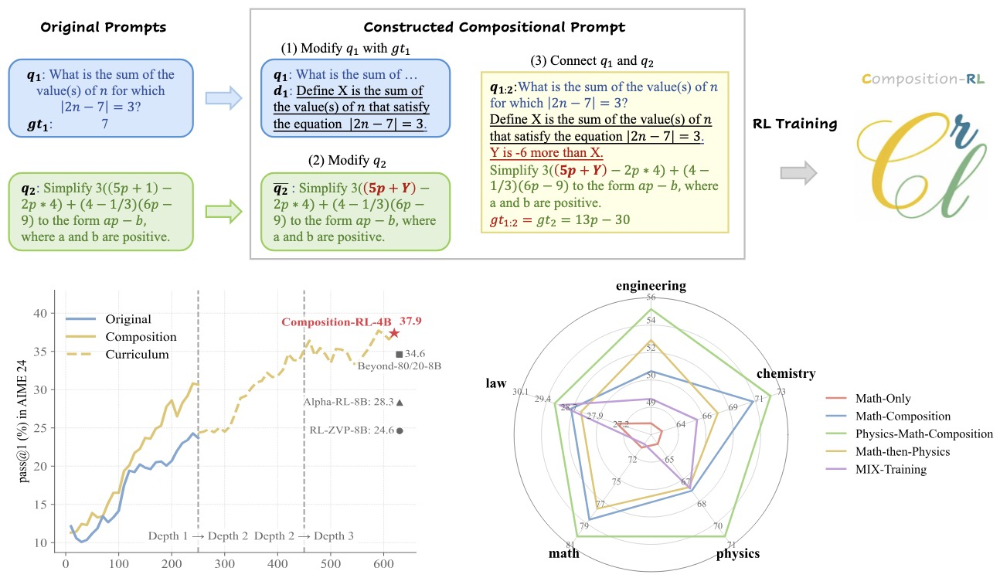

<div align="center" style="font-family: charter;">
<h1>Composition-RL: Compose Your Verifiable Prompts for Reinforcement Learning of Large Language Models</h1>

<a href="https://arxiv.org/abs/2602.12036" target="_blank">
    </a>
<a href="https://huggingface.co/collections/xx18/composition-rl" target="_blank">
    </a>


<div>
<a href="https://xinxu-ustc.github.io/" target="_blank">Xin Xu</a><sup>1,2</sup>,
<a href="" target="_blank">Clive Bai</a><sup>1</sup>,
<a href="https://yk7333.github.io/" target="_blank">Kai Yang</a><sup>1</sup>,
<a href="https://github.com/dandingsky" target="_blank">Tianhao Chen</a><sup>2,</sup>,
<a href="https://github.com/kkane99" target="_blank">Yangkun Chen</a><sup>1</sup>,
<a href="https://github.com/autoliuweijie" target="_blank">Weijie Liu</a><sup>1</sup>,
</div>

<div>
<a href="https://scholar.google.com/citations?hl=en&user=Z_t5DjwAAAAJ" target="_blank">Hao Chen</a><sup>2</sup>,
<a href="https://www.presidentsoffice.hku.hk/leadership/professor-yang-wang" target="_blank">Yang Wang</a><sup>3,</sup>,
<a href="https://github.com/yangsaiyong" target="_blank">Saiyong Yang</a><sup>1†</sup>,
<a href="https://sites.google.com/site/eeyangc/" target="_blank">Can Yang</a><sup>2†</sup>
</div>

<div>
<sup>1</sup>Tencent HY&emsp;<br>
<sup>2</sup>The Hong Kong University of Science and Technology&emsp;<br>
<sup>3</sup>The University of Hong Kong&emsp;<br>
</div>
</div>

---

## 📝 News

- [2025/03/03] We released our evaluation and data generation codes.
- [2026/02/12] We released the [paper](https://arxiv.org/abs/2602.12036) and [datasets & models](https://huggingface.co/collections/xx18/composition-rl)!

## 🧠 Overview
<p align="center">
  
</p>

Composition-RL is a data-efficient RLVR approach that combats the growing number of “too-easy” prompts (pass-rate = 1) by automatically composing multiple verifiable problems into a single, harder yet still-verifiable prompt, and then performing RL on these compositional prompts to maintain informative training signals. 
Across 4B–30B models, Composition-RL consistently improves reasoning performance over RL on the original dataset, gains further boost with a curriculum that gradually increases composition depth, and enables stronger cross-domain RL (e.g., math + physics) than simply mixing or sequentially training on the two domains.

## 🚀 Quick Start

### Installation

#### 1. Environment setup
```bash
conda create -n crl python=3.10 -y
conda activate crl
```

#### 2. Requirements installation
```bash
pip install torch==2.6.0 torchvision==0.21.0 torchaudio==2.6.0 --index-url https://download.pytorch.org/whl/cu124
pip install vllm==0.8.5.post1
cd verl
pip install -e .
pip install vertexai
pip install sentence_transformers
pip install flash-attn==2.7.4.post1 --no-build-isolation
```

### Data Generation

Our datasets are available at [Composition-RL HF](https://huggingface.co/collections/xx18/composition-rl), and you can download them therein.
If you want to generate your own dataset, please follow these steps:

First, deploy vllm instances across nodes:
```bash
cd deployment

# export your node ip lists, e.g., 192.168.1.101:8,192.168.1.102:8
export NODE_IP_LIST=xxx 
bash nodes_config.sh
bash deploy_vllm_cluster.sh # wait 2-3 mins for serving llms
bash generate_config.sh # It will generate a generated_vllm_config.yaml file
```

These steps will deploy vllm instances across your nodes. The generated configuration file `deployment/generated_vllm_config.yaml` contains `resp_urls`, `resp_server_names`, and `resp_api_keys`.

Copy these configurations to `/apdcephfs_zwfy3/share_302867165/xxucaxu/codes/BGRPO/NCSP/paper/repo/testtest/NCSP/project/NCSP/config/v4_4step/stable_with_code_math4500_demo.yaml` and adapt the `dataset_path` to your own datasets.

Then, run the following commands:
```bash
python3 main.py --config_path project/NCSP/config/v4_4step/your_config.yaml
```
The results will be saved to the `output_folder` parameter of your config file.

Finally, make the final dataset using the following command:
```bash
python3 project/NCSP/custom_functions/v4_4step/pre_and_post/make_final_dataset.py --path project/NCSP/result/v4_4step/your_path/step10.jsonl --save_path $your_save_path
```

### Run Evaluation

First, download the evaluation datasets using
```bash
hf download xx18/Composition-RL-EVA --repo-type=dataset --local-dir ./data/eval
```

All test datasets are downloaded to the folder `data/eval`.

for evaluation, use:
```bash
bash ./scripts/ray_start.sh # start ray, use pssh to run on multiple nodes if necessary
bash scripts/eval/start_generate.sh
```

The resulting metrics and evaluation outputs will be saved under the folder `your_model_path/eval_results`.


## 🤗 Datasets and Models

We are open-sourcing our complete code and training details for the research community. All our checkpoints can be found in [Composition-RL Collection](https://huggingface.co/collections/xx18/composition-rl).

| Name | Link | Remarks | 
| - | - | - |
| Evaluation Sets | [Composition-RL-EVA](https://huggingface.co/datasets/xx18/Composition-RL-EVA) | All evaluation datasets used in our paper, including AIME24, AIME25, BeyondAIME, IMO-AnswerBench, GPQA, and MMLU-Pro |
| MATH-Composition-199K | [MATH-Composition-199K](https://huggingface.co/datasets/xx18/MATH-Composition-199K) | Training set of our main experiments; Results in Table 1 and Section 4.2 |
| MATH-Composition-Depth3 | [MATH-Composition-Depth3](https://huggingface.co/datasets/xx18/MATH-Composition-Depth3) | Training set of our curriculum RL; Results in Table 1 and Section 4.3 |
| Physics-MATH-Composition-141K | [Physics-MATH-Composition-141K](https://huggingface.co/datasets/xx18/Physics-MATH-Composition-141K) | Training set of our cross-domain experiments; Results in Table 2 and Section 4.4 |
| Composition-RL-4B | [Composition-RL-4B](https://huggingface.co/xx18/Composition-RL-4B) | Initial Model: Qwen3-4b-Base; Training set: MATH-Composition-199K; Results in Table 1 |
| Composition-RL-8B | [Composition-RL-8B](https://huggingface.co/xx18/Composition-RL-8B) | Initial Model: Qwen3-8b-Base; Training set: MATH-Composition-199K; Results in Table 1 |
| Composition-RL-14B | [Composition-RL-14B](https://huggingface.co/xx18/Composition-RL-14B) | Initial Model: Qwen3-14b-Base; Training set: MATH-Composition-199K; Results in Table 1 |
| Composition-RL-30B-A3B | [Composition-RL-30B-A3B](https://huggingface.co/xx18/Composition-RL-30B-A3B) | Initial Model: Qwen3-30b-a3b-Base; Training set: MATH-Composition-199K; Results in Table 1 |
| Baseline-4B-MATH12K | [Baseline-4B-MATH12K](https://huggingface.co/xx18/Baseline-4B-MATH12K) | Initial Model: Qwen3-4b-Base; Training set: MATH12K; Results in Table 1 |
| Composition-RL-4B-Depth1_2 | [Composition-RL-4B-Depth1_2](https://huggingface.co/xx18/Composition-RL-4B-Depth1_2) | Initial Model: Baseline-4B-MATH12K; Training set: MATH-Composition-199K; Results in Table 1 |
| Composition-RL-4B-Depth1_2_3 | [Composition-RL-4B-Depth1_2_3](https://huggingface.co/xx18/Composition-RL-4B-Depth1_2_3) | Initial Model: Composition-RL-4B-Depth1_2; Training set: MATH-Composition-Depth3; Results in Table 1 |
| Composition-RL-4B-Physics_Math | [Composition-RL-4B-Physics_Math](https://huggingface.co/xx18/Composition-RL-4B-Physics_Math) | Initial Model: Qwen3-4b-Base; Training set: Physics-MATH-Composition-141K; Results in Table 2 |


## 📮Contact
If you have any questions or would like to discuss collaboration, please feel free to contact:  
Xin Xu — [xxuca@connect.ust.hk](mailto:xxuca@connect.ust.hk)  

Saiyong Yang — [stevesyang@tencent.com](mailto:stevesyang@tencent.com)

Can Yang - [macyang@ust.hk](mailto:macyang@ust.hk)

## 🤝 Acknowledgement

We are deeply grateful for the following GitHub repositories, as their valuable code and efforts have been incredibly helpful:

* [VeRL](https://github.com/volcengine/verl)
* [NCSP](https://github.com/gooooood-coder/NCSP)
* [DeepScaler](https://github.com/agentica-project/rllm)


## 📚 Citation
If you find our work helpful for your research, please consider citing our paper:
```
@article{xu2026composition-rl,
  title={Composition-RL: Compose Your Verifiable Prompts for Reinforcement Learning of Large Language Models},
  author={Xu, Xin and Bai, Clive and Yang, Kai and Chen, Tianhao and Chen, Yangkun and Liu, Weijie and Chen, Hao and Wang, Yang and Yang, Saiyong and Yang, Can},
  journal={arXiv preprint arXiv:2602.12036},
  year={2026}
}
```
